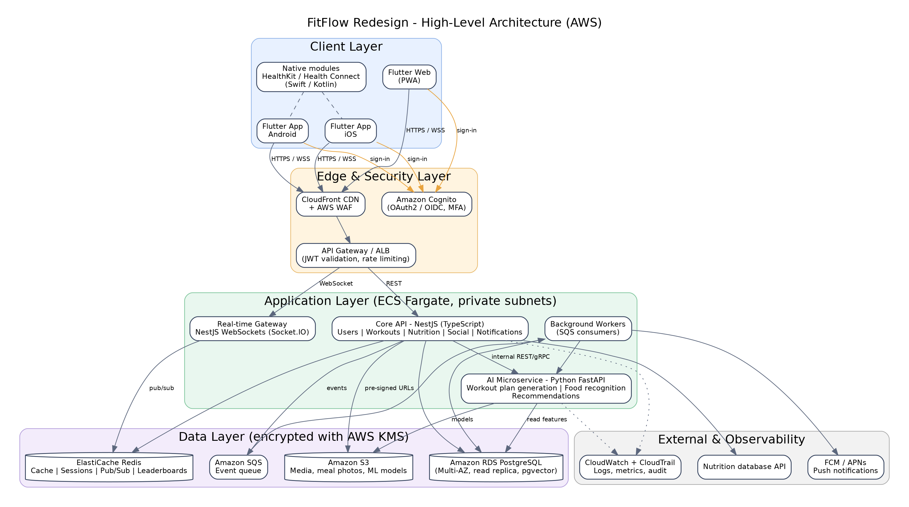

# FitFlow Redesign

Technology selection and architecture for the redesign of **FitFlow**, a cross-platform fitness app
(iOS, Android and web) with AI-personalised workout plans, social sharing and nutrition tracking.

> IT3060 – Human Computer Interaction · Lab Exercise 05 · SLIIT · Semester 2, 2026

## Recommended technology stack

| Layer | Choice | Why (short) |
|---|---|---|
| Mobile & web client | **Flutter** (Dart) + native Swift/Kotlin modules for HealthKit / Health Connect | One codebase for iOS, Android and web; near-native performance |
| Core backend API | **NestJS** (Node.js, TypeScript) | Structured, modular, first-class WebSockets, easy to maintain |
| AI microservice | **Python FastAPI** | Direct access to the Python ML ecosystem (PyTorch, scikit-learn) |
| Primary database | **PostgreSQL** on Amazon RDS (+ pgvector) | ACID for health data, strong querying, HIPAA-eligible service |
| Cache / real-time | **Redis** (Amazon ElastiCache) | Caching, sessions, pub/sub, leaderboards |
| File storage | **Amazon S3** + CloudFront | Meal photos, media, ML model artefacts |
| Authentication | **Amazon Cognito** | OAuth2/OIDC, MFA, social login, HIPAA-eligible, low cost per MAU |
| Hosting | **AWS** (ECS Fargate, SQS, CloudWatch, KMS, WAF) | One compliance boundary under a single BAA |

Weighted decision score of the full recommended stack: **4.65 / 5** (see [comparison matrix](docs/comparison-matrix.md)).

## Repository structure

```
fitflow-redesign/
├── frontend/        # Flutter app (iOS, Android, Web)
├── backend/         # NestJS core API + real-time gateway
├── ai-service/      # FastAPI AI microservice
├── infra/           # Infrastructure as code (AWS CDK / Terraform)
├── docs/
│   ├── tech-stack-summary.md
│   ├── comparison-matrix.md
│   ├── data-flows.md
│   ├── architecture/architecture.png
│   └── adr/ADR-001-technology-stack.md
└── .github/workflows/ci.yml
```

## Architecture



## Getting started

Each service folder has its own README. Planned local setup:

```bash
# frontend
cd frontend && flutter pub get && flutter run
# backend
cd backend && npm install && npm run start:dev
# ai-service
cd ai-service && pip install -r requirements.txt && uvicorn app.main:app --reload
```

## Branching and contribution

- `main` is protected: changes arrive through pull requests with at least 1 approval and a passing CI run.
- Branch names: `feature/<name>`, `fix/<name>`, `docs/<name>`.
- Commit messages follow Conventional Commits (`feat:`, `fix:`, `docs:`).

## Documentation

- [Tech stack summary](docs/tech-stack-summary.md)
- [Technology comparison matrix](docs/comparison-matrix.md)
- [Data flows](docs/data-flows.md)
- [ADR-001: Technology stack](docs/adr/ADR-001-technology-stack.md)
